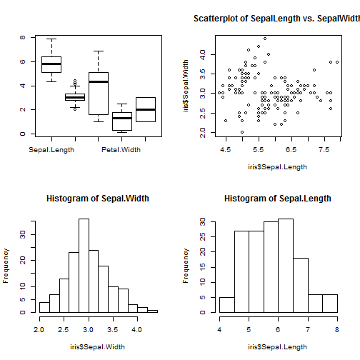
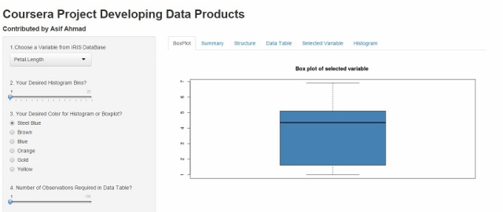

##Iris DataSet
 - Project have interactive data visualization through graphs and tables 

- For visualization of data products there are `6 Tabs` as:
        
        Boxplot | Summary | Structure | DataTable  |Selected Variable| Histogram |
        
 - Side bar consists of following:
        
1. `Dropdown menu` -->  from which user can select a variable                                 
2. `slider`--> is used to select bins and observations
3. `Radio Buttons`--> is used to to select color of bins and boxplot


--- 
##Description of `TABS`

1. BoxPlot: This Tab display boxplot, color of boxplot changed by radio buttons.

2. Summary: This Tab display summary statistics of selected variable.

3. Structure: This Tab describe the structure of whole dataset

4. DataTable: Here we select number of observation of table

5.Selected Variable: This Tab show  the data of a single selected variable

6. Histogram: This show the colorful Histogram of a single variable. 


---fig.align='center'
        
##Slide without code

 

---
##Slide With Code
        


```r
summary(iris[,1:3])
```

```
##   Sepal.Length    Sepal.Width     Petal.Length  
##  Min.   :4.300   Min.   :2.000   Min.   :1.000  
##  1st Qu.:5.100   1st Qu.:2.800   1st Qu.:1.600  
##  Median :5.800   Median :3.000   Median :4.350  
##  Mean   :5.843   Mean   :3.057   Mean   :3.758  
##  3rd Qu.:6.400   3rd Qu.:3.300   3rd Qu.:5.100  
##  Max.   :7.900   Max.   :4.400   Max.   :6.900
```


---
##Project Interface Figure and Link 
        
[Click Here to See Project] (https://asifahmad.shinyapps.io/Coursera_Project/) 

 

Screen Shot of Project:  (https://asifahmad.shinyapps.io/Coursera_Project/) 


